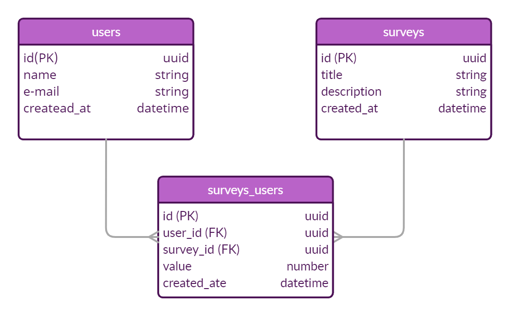

<h1 align="center">Next Level Week 4 🚀 - Node.js</h1>

<p align="center">
 
 
</p>

# 💻 O Projeto
 
</p>

Desenvolvido durante a quarta edição do evento Next Level Week da Rocketseat, o projeto consiste em uma API (Application Programming Interface) que, dentre outras funcionalidades, tem como objetivo principal realizar o cálculo de NPS (Net Promoter Score), que avalia a satisfação dos clientes ao utilizar os serviços de uma empresa. 
<br/>
<br/>
Foi desenvolvido um sistema completo de backend, com realização de cadastros, testes automatizados e envio de e-mails, utilizando Typescript e Express para gerenciamento de rotas e TypeORM para a manipulação dos dados.
<br>

## ✨ Tecnologias
Esse projeto foi desenvolvido com as seguintes tecnologias:

- [Node.js](https://nodejs.org/en/)
- [Typescript](https://www.typescriptlang.org/)
- [Ethereal-Email](https://ethereal.email/)
- [TypeORM](https://typeorm.io/#/)
- [Express](https://expressjs.com/pt-br/)
- [Jest](https://jestjs.io/)
- [Handlebars](https://handlebarsjs.com/)
- [Beekeeper Studio](https://www.beekeeperstudio.io/)
- [Postman](https://www.postman.com/)

## 🔶 Diagrama ER



## 🚀 Como executar
- Clone o repositório
```
$ git clone https://github.com/RaquelKO/next-level-week-4__node-js/
```
- Instale as dependências descritas no arquivo `package.json`:
```
$ yarn add ...
```
- Inicie o servidor:
```
$ yarn dev
```
- Execute os testes automatizados:
```
$ yarn test
```
✓ A aplicação pode ser acessada em [`localhost:3333`](http://localhost:3333).
<br/>
<br/>
## 📄 Licença
Esse projeto está sob a licença MIT. Veja o arquivo [LICENSE](LICENSE.md) para mais detalhes.

---

Adaptado com ♥ por mim! Feito com ♥ by Rocketseat
